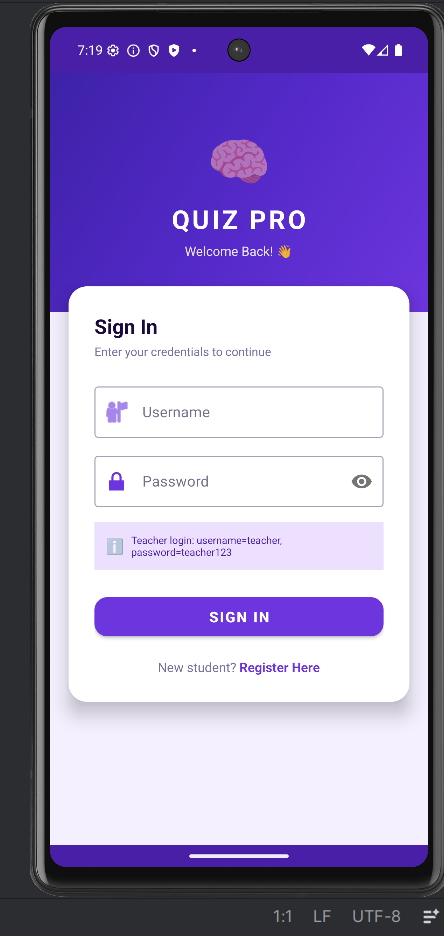
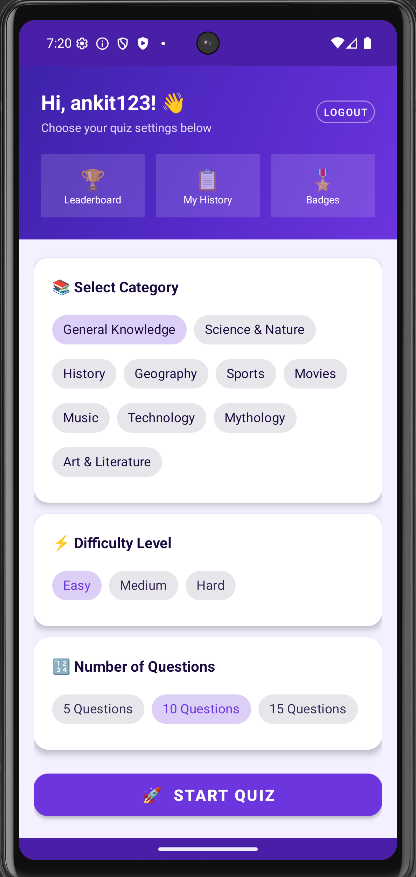
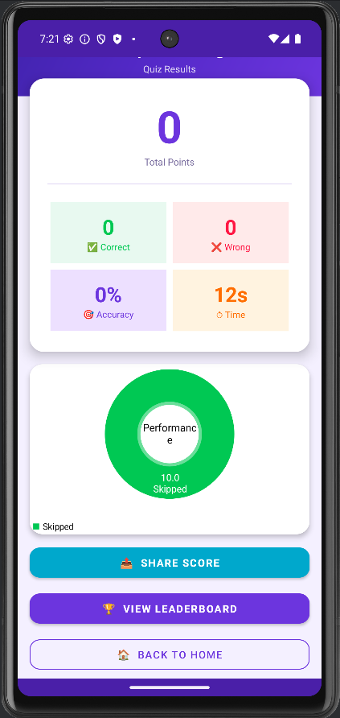
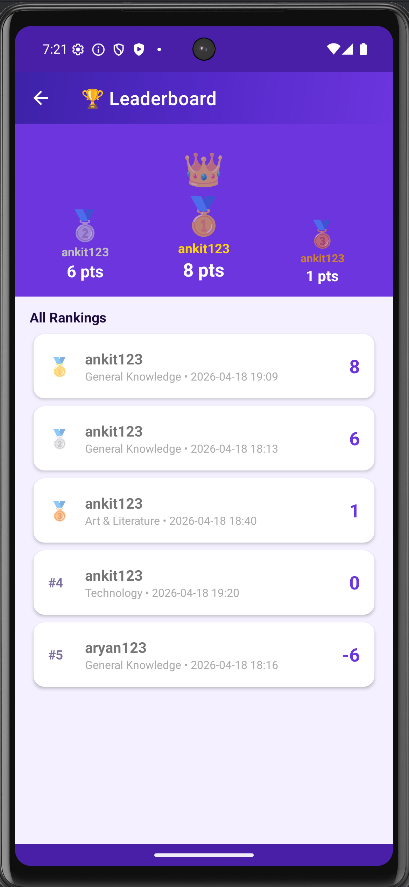
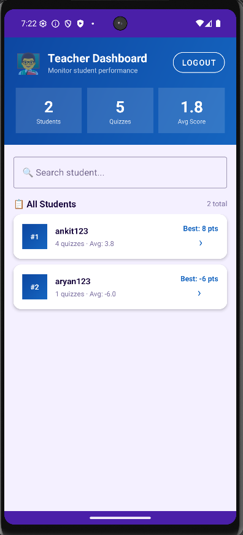

# QuizMaster Ultimate 🎓

A professional Android Quiz application built natively with Java and SQLite. Designed with modern UX/UI principles, featuring gamification elements, dual user-role functionality (Student/Teacher dashboards), and dynamic question pulling via REST APIs.

## 📸 App Showcase
*(To display these, simply create a folder named `screenshots` in this project, and save your 5 screenshots there as `login.png`, `category.png`, `result.png`, `leaderboard.png`, and `teacher.png`)*

  
  
  
  
  

## 🚀 Features

### For Students
*   **Modern Gamified Interface:** Premium gradient-based aesthetic with clean Material 3 design components.
*   **Dynamic Quizzes:** Choose from 10+ Trivia categories and adjustable difficulties (Easy, Medium, Hard). Questions are dynamically fetched using the Open Trivia API.
*   **Live Timers & Streaks:** Every question has a 30-second countdown timer. Answer sequentially without failing to build up a fire streak 🔥!
*   **Achievement System:** Unlock digital badges (e.g., "Speed Demon", "Perfect Score") based on quiz performance constraints.
*   **Detailed Analytics:** Interactive Pie Charts displaying performance accuracy, overall ranks, and individual history timelines.

### For Teachers/Admins
*   **Elevated Registration:** Native Multi-role selection allowing users to securely spin up new Teacher dashboard accounts.
*   **Student Monitoring Dashboard:** A dedicated command-center UI allowing teachers to audit the entire registered student body.
*   **Performance Metrics:** Tracks total attempts, cumulative scores, best categories, and visualizes overall classroom averages.

## 🛠️ Technology Stack
*   **Language:** Java (Android SDK)
*   **UI/UX:** XML, Material Design Components (Chips, Cards, AppBars), Custom Drawables
*   **Database:** SQLite (Local Device Storage) via `SQLiteOpenHelper`. Fully normalized relational tables handling users, attempts, attempt_details, and badges.
*   **Networking:** `OkHttp3` for REST API data consumption and asynchronous JSON parsing.
*   **Data Visualization:** `MPAndroidChart` for rendering dynamic result pie charts and statistics graphs.

## 📋 Database Architecture (SQLite)
The local database utilizes a normalized schema covering four primary tables:
1.  **Users:** Tracks credential authentication and assigned roles (Student / Teacher).
2.  **Attempts:** Logs individual quiz sessions linked back to user IDs containing categorized metrics (Score, Max Score, Category).
3.  **Attempt Details:** Micro-tracking table that isolates exact individual responses for deeply granular history.
4.  **Badges:** Tracks earned gamification awards securely on the device.

## 📲 How To Run
1. Clone or download this repository.
2. Open the project folder in **Android Studio**.
3. Let Gradle sync naturally and fetch the required dependencies (`OkHttp` and `MPAndroidChart`).
4. Click **Run** on a hardware device or the Android Studio Emulator (API 24+ recommended).

## 💡 Future Implementations
*   Migrate isolated SQLite device-storage to a real-time cloud backend (Firebase Cloud Firestore) for global syncing and authentic multi-device Classroom logic.
*   Implement `ShareCompat` deep-linking to natively post custom graphic scores to Instagram or Twitter.

---
_Developed independently as a portfolio demonstration for native Android UI aesthetic design and relational data construction._
